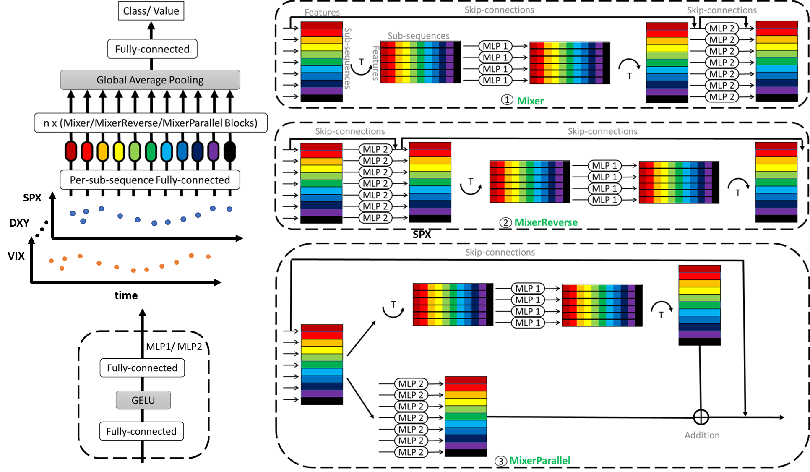

# Prediction with Time-Series Mixer for the S&P500 Index

[[paper](https://ieeexplore.ieee.org/abstract/document/10148151)]



## News
- [2023/02] 🔥 **Our TS-Mixer paper is accepted by [ICDE Workshop 2023](https://icde2023.ics.uci.edu/workshops/)**.

## Abstract
As an essential US economic indicator, the S&P500 Index is used to assess the current state of market performance and gauge the economy’s future course. However, stock market index prediction is challenging due to its nonlinearity and inherently volatile character. Recurrent Neural Networks (RNN) and their variants are de facto standards for sequence modeling. Recently, Convolutional Neural Networks (CNN) and attention-based networks, such as dilated casual convolutions and Transformers, have also become popular in time series forecasting. In this paper, we report on the design of a Time-Series Mixer (TS-Mixer) architecture based on MLP-Mixer, an all-MLP architecture for time series forecasting. 

To the best of our knowledge, this is the **first implementation of MLP-Mixer-based architecture for sequence modeling**. Modern deep learning models are increasingly built to handle univariate time series data. They generally pay attention to analyzing temporal dependencies while ignoring the relationship among features. The proposed architecture is specifically created for multivariate time series forecasting to capture temporal feature interactions while simultaneously learning feature correlations. To accomplish this, the proposed Time-Feature Mixer contains two types of MLP layers: feature mixer and temporal mixer. The feature mixer is applied independently to each data point to capture the correlation among features. In contrast, the temporal mixer extracts temporal dependency (trend, seasonal, cyclical, or random characteristics) of each feature across the whole input sequence. Compared to prevalent neural networks in sequence modeling, TS-Mixer exhibits competitive performance regarding S&P500 Index prediction.

## Citation
If you find this project is helpful to your research, please consider to cite our paper:
```
@inproceedings{ye2023prediction,
  title={Prediction with time-series mixer for the S\&P500 index},
  author={Ye, Junyi and Gu, Jingyi and Dash, Ankan and Deek, Fadi P and Wang, Guiling Grace},
  booktitle={2023 IEEE 39th International Conference on Data Engineering Workshops (ICDEW)},
  pages={20--27},
  year={2023},
  organization={IEEE}
}
```
